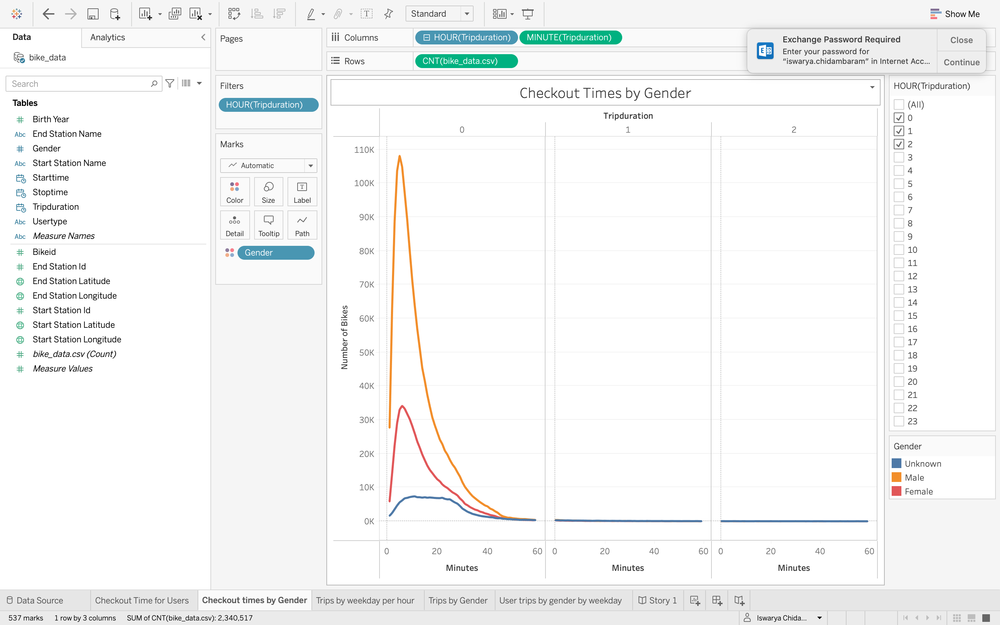

# Overview of Statistical Analysis:
The purpose of this analysis is to to convince investors that a bike-sharing program in Des Moines is a solid business proposal. To solidify the proposal visualisations are created to show the length of time that bikes are checked out for all riders and genders,
the number of bike trips for all riders and genders for each hour of each day of the week and to show the number of bike trips for each type of user and gender for each day of the week.

## Results:
 1.
 From this visualisation we can clearly see that men used the most number of bikes and the trip time is within an hour.

 2.
 From this visualisation we can clearly see that males used the most number of bikes and the chekout times is within an hour.

 3.
 From this visualisation we can clearly see that the busy time in the weekdays are 5pm to 7pm.

 4.
 From this visualisation we can infer that men use the most bikes in weekdays from 5pm to 7pm.

 5.
 From this visualisation we can see that men subscribers use the most bikes in the weekday evenings.

 6.
 From this visualisation we can infer that Pershing Square North has the most number of bikes as the Starting point.

 7.
 From this visualisation we can infer that from Pershing Square North, men have used the most number of bikes.

## Summary:
From all the visualisation we can summarize that the trip time of the bikes in within an hour. The bikes are mostly used by men in weekdays from 5 pm to 7pm. The most pickup point of the bike is the Pershing Square North. Also men used this pickup most more than the females. Generally the subscribers tend to use the bikes more than the one time customers.

Link:
[Link to Dashboard](https://public.tableau.com/app/profile/iswarya.chidambaram)